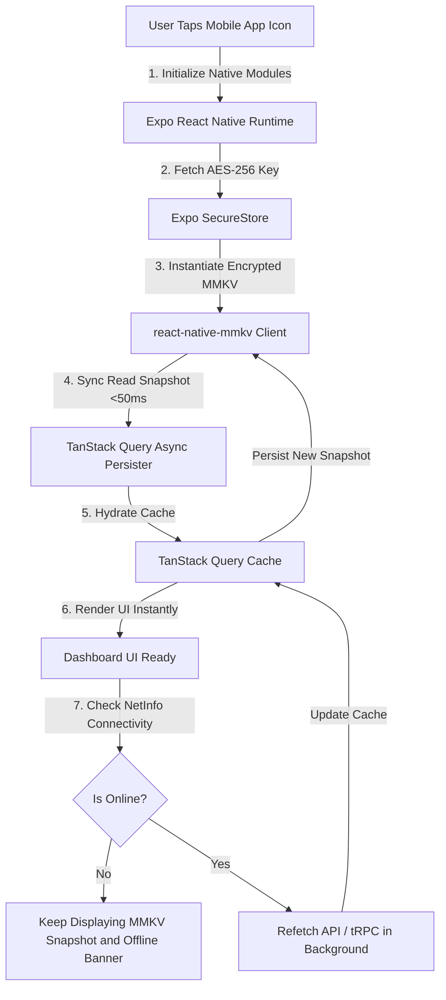
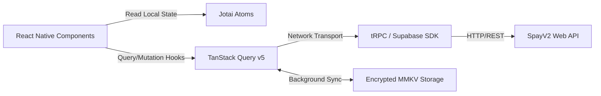

# SpayV2 Mobile App — Architecture and Technical Specifications

> Cross-platform React Native (Expo) mobile application for SpayV2 expense tracking and BNPL payment management. Engineered with an offline-first architecture, encrypted local cache persistence, and biometric security.

---

## Table of Contents
1. [Mobile Technical Architecture](#mobile-technical-architecture)
2. [Encrypted Offline Persistence Engine (`queryPersister.ts`)](#encrypted-offline-persistence-engine-querypersisterts)
3. [State Management and Data Layer](#state-management-and-data-layer)
4. [Native Features and Device Integration](#native-features-and-device-integration)
5. [UI/UX Design Tokens and Animation Architecture](#uiux-design-tokens-and-animation-architecture)
6. [Directory Structure and Screen Navigation](#directory-structure-and-screen-navigation)
7. [Environment Variables Setup](#environment-variables-setup)
8. [Build and Compilation Guide (Android and iOS)](#build-and-compilation-guide-android-and-ios)
9. [Testing and Quality Assurance](#testing-and-quality-assurance)

---

## Mobile Technical Architecture

The SpayV2 Mobile App uses an offline-first data architecture designed to eliminate loading spinners on launch, support zero-connectivity operation, and handle transient network failures gracefully.



---

## Encrypted Offline Persistence Engine (`queryPersister.ts`)

Located in `src/utils/queryPersister.ts`, the persistence engine provides secure, hardware-backed local storage for offline queries.

### 1. Hardware Encryption Key Architecture
* **Key Generation**: Generates a 256-bit (64-character hex) encryption key upon first boot.
* **Storage**: Secured inside iOS Keychain or Android Keystore via `expo-secure-store`.
* **MMKV Engine**: `react-native-mmkv` mounts with `encryptionKey` and `encryptionType: 'AES-256'`.

### 2. Resilient Decryption Fallback Mechanics
If `SecureStore` key retrieval fails or key corruption occurs (common during OS upgrades or hot-reload restarts), the initialization sequence prevents app crashes:

```typescript
// Architectural Decryption Recovery Pseudocode
function getStorageInstance(): MMKV {
  const key = getOrCreateEncryptionKey();
  try {
    return createMMKV({ id: 'spay-query-cache', encryptionKey: key, encryptionType: 'AES-256' });
  } catch (error) {
    console.error('MMKV Decryption Failure. Purging corrupt cache...');
    try {
      // Step 1: Attempt mounting clean unencrypted fallback store
      return createMMKV({ id: 'spay-query-cache-fallback' });
    } catch (fallbackError) {
      // Step 2: Ultimate fallback to in-memory mock if storage partition damaged
      return createMemoryOnlyMockStorage();
    }
  }
}
```

### 3. Lazy Proxy Instantiation
The storage engine uses a JavaScript `Proxy` wrapper (`export const storage = new Proxy(...)`) to defer native module access until the first query execution, preventing top-level module import crashes during app startup.

---

## State Management and Data Layer



---

## Native Features and Device Integration

| Native Feature | Library / Module | Description |
| :--- | :--- | :--- |
| **Biometric Security** | `expo-local-authentication` | Lock app access behind FaceID / TouchID / Biometric Prompt on app resume. |
| **Haptic Feedback** | `expo-haptics` | Tactile feedback on button presses, payment confirmations, and swipe gestures. |
| **Push Notifications** | `@notifee/react-native` + `expo-notifications` | Multi-channel local and FCM remote alerts for bill payment reminders. |
| **Secure Key Storage** | `expo-secure-store` | Hardware key isolation for session tokens and MMKV encryption keys. |
| **Image Caching** | `expo-image` | High-speed disk and RAM image caching for bill receipts and avatars. |
| **Quick Actions** | `expo-quick-actions` | Home screen app icon long-press shortcuts ("Pay Bill", "Add Order"). |
| **Home Screen Widgets**| Native Android/iOS Widget bridge | Display remaining credit limit and next payment due date on home screen. |

---

## UI/UX Design Tokens and Animation Architecture

### Design Tokens (`@expo-google-fonts/plus-jakarta-sans`, `inter`, `outfit`)
* **Colors**: Premium modern dark/light palette (Primary: `#F53D2D`, Success: `#10B981`, Slate Surface: `#0F172A`).
* **Typography**: Dynamic scale using `responsive.ts` utility scaling seamlessly across small phones and large tablets.

### Virtualization and Animations
* **List Virtualization**: Powered by `@shopify/flash-list` (`estimatedItemSize={72}`) guaranteeing 60fps scrolling over thousands of payment items.
* **Layout Animations**: `react-native-reanimated` 4 + `moti` for entry transitions and accordion expansions.
* **Bottom Sheets**: `@gorhom/bottom-sheet` for seamless, gesture-driven filter sheets and payment proof uploads.

---

## Directory Structure and Screen Navigation

```text
mobile/
├── src/
│   ├── components/         # UI Primitives
│   │   ├── common/         # Buttons, Cards, Badges, Modals, Loading Skeletons
│   │   ├── dashboard/      # Credit progress ring, Due date cards, Quick Actions bar
│   │   ├── orders/         # Order item row, Installment timeline viewer
│   │   └── payments/       # Payment status pill, Receipt dropzone
│   ├── context/            # Global Auth and Theme Context Providers
│   ├── hooks/              # Custom React Hooks
│   │   ├── useAuthProfile.ts
│   │   ├── useSpayOrders.ts
│   │   ├── useBiometrics.ts
│   │   └── useNetInfo.ts
│   ├── navigation/         # React Navigation Setup
│   │   ├── RootNavigator.tsx
│   │   ├── AuthStack.tsx
│   │   └── MainTabNavigator.tsx
│   ├── screens/            # Screen Views
│   │   ├── auth/           # Login, OTP Verification, Biometric Prompt
│   │   ├── dashboard/      # Home Dashboard Screen
│   │   ├── orders/         # Orders List and Order Detail Screen
│   │   ├── payments/       # Payment Schedule and Receipt Upload Screen
│   │   ├── nootai/         # NootAI Chat Assistant Interface
│   │   └── profile/        # User Settings, Preferences and Security Screen
│   ├── services/           # Network Transport Services
│   └── utils/              # Utilities
│       ├── queryPersister.ts  # Encrypted MMKV Persister
│       ├── trpc.ts            # tRPC Client Initialization
│       ├── money.ts           # Dinero.js Currency Helpers
│       └── widgetSync.ts      # Native Home Widget Bridge
├── widgets/                # Android / iOS Native Widget Configs
├── app.json                # Expo Plugin and App Manifest
└── build-android-prod.ps1  # Automated Production Build Script
```

---

## Environment Variables Setup

Create a `.env` file in `mobile/`:

```env
# Application Endpoints
EXPO_PUBLIC_API_URL="https://your-spay-web-portal.com"
EXPO_PUBLIC_SUPABASE_URL="https://[REF].supabase.co"
EXPO_PUBLIC_SUPABASE_ANON_KEY="eyJhbGciOi..."

# Firebase and FCM Messaging
EXPO_PUBLIC_FCM_SENDER_ID="123456789012"
```

---

## Build and Compilation Guide (Android and iOS)

### Local Development Setup

```bash
# 1. Navigate to mobile directory
cd mobile

# 2. Install dependencies
npm install

# 3. Start Expo CLI development server
npm start

# 4. Launch on Android Emulator
npm run android

# 5. Launch on iOS Simulator (macOS only)
npm run ios
```

### Production Android APK Build Script

Use the built-in PowerShell automation script to compile standalone Android APKs:

```powershell
# Run production build script
.\build-android-prod.ps1
```

This script automatically handles Gradle clean, dependency checks, release keystore signing, and outputs the signed `.apk` to `mobile/APK/release/app-release.apk`.

---

## Testing and Quality Assurance

```bash
# Run unit and hook tests (Vitest)
npm run test

# Run TypeScript type check
npx tsc --noEmit

# Run ESLint audit
npm run lint
```
